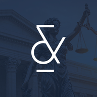

<div align="center">

  <!-- Logo da Organização -->
  

  # **TechLPDB**
  ### *Tecnologia, Inovação e Inteligência para o Setor Jurídico*

  [](#)
  [](#)
  [](#)

  <p align="center">
    Bem-vindo ao centro de engenharia e tecnologia da <b>LPDB Advogados Associados</b>.<br>
    Aqui desenvolvemos, mantemos e otimizamos as soluções digitais e automações da organização.
  </p>

</div>

---

### 📌 Sobre a TechLPDB

A **TechLPDB** é o braço tecnológico responsável por criar soluções de software, automações de processos e análise de dados para dar suporte às operações jurídicas e administrativas da **LPDB**.

Nossa missão é alinhar eficiência tecnológica, segurança da informação e governança em todos os nossos sistemas e fluxos de trabalho.

---

### 🔐 Diretrizes da Organização

> ⚠️ IMPORTANTE: Todo novo repositório deve seguir o padrão de identificação
> do Technology Hub. A classificação é feita diretamente na descrição do
> repositório através dos prefixos padronizados.

1. **Privacidade Primeiro:** Todos os dados sensíveis e credenciais de acesso devem ser mantidos estritamente confidenciais e gerenciados via variáveis de ambiente (`.env`).

2. **Boas Práticas de Commit:** Mantenha históricos de *commits* limpos, organizados e descritivos.

3. **Fluxo de Trabalho:** Alterações em projetos principais devem passar por revisão via *Pull Request* e validação da equipe.

4. **Identificação Obrigatória dos Repositórios:** Todo novo repositório criado na organização deve possuir uma **descrição padronizada**, contendo obrigatoriamente os prefixos de classificação utilizados pelo Technology Hub.

   Formato:
   
   ```
   [TIPO] Descrição do projeto
   ```
   Exemplo:
  ```
  [AUTOMATION]  Automação para notificações de perícias.
  [PROJECT] Plataforma para análise e exploração de dados.
  [AGENT] Agente para auxiliar na análise de documentos jurídicos.
  [INTEGRATION] Integração com sistemas de comunicação com clientes.
  ```

Os prefixos devem ser escritos no início da descrição, entre colchetes e separados por espaços.

O restante da descrição deve apresentar, de forma breve e objetiva, a finalidade do repositório.

Classificação e Technology Hub: Os prefixos presentes na descrição serão utilizados automaticamente pelo Technology Hub para categorizar, organizar e disponibilizar os repositórios da organização. Não é necessário realizar um cadastro separado no Hub.

Padronização de Categorias: Utilize somente categorias reconhecidas pela organização. As categorias disponíveis incluem:

Tipos:
[PROJECT] [AUTOMATION] [SKILL] [AGENT] [INTEGRATION] [TOOL] [LIBRARY] [TEMPLATE] [INFRASTRUCTURE] [DOCUMENTATION]

Novas categorias podem ser adicionadas conforme a evolução da organização e do Technology Hub.

7.  **Repositórios sem Classificação:** Repositórios sem os prefixos obrigatórios poderão ser identificados pelo Hub como não classificados e deverão ser adequados ao padrão assim que possível.

---

### 🚀 Quer ajuda com seu projeto? Ou teve alguma ideia?

O **TechLab** funciona como um **berçário de projetos e guia de boas práticas** do escritório. É o nosso espaço dedicado a descomplicar a tecnologia, ensinar conceitos básicos do dia a dia e ajudar qualquer pessoa da equipe, **mesmo sem conhecimento prévio em programação** a criar automações, organizar ideias e aplicar inovação na rotina jurídica.

<div align="center">

👉 <b><a href="https://techlablpdb.vercel.app/" target="_blank" rel="noopener noreferrer">Acesse o Portal do TechLab</a></b> 👈

</div>

*  **Ideação & Incubação:** Dê o primeiro passo com suporte técnico para estruturar e validar sua ideia.
*  **Guia Descomplicado:** Aprenda boas práticas, uso correto das ferramentas do escritório e conceitos básicos de tecnologia.
*  **Colaboração Aberta:** Um ambiente seguro e amigável para tirar dúvidas, aprender e construir em equipe.

---

<div align="center">
  <sub>© TechLPDB • LPDB Advogados Associados</sub>
</div>
